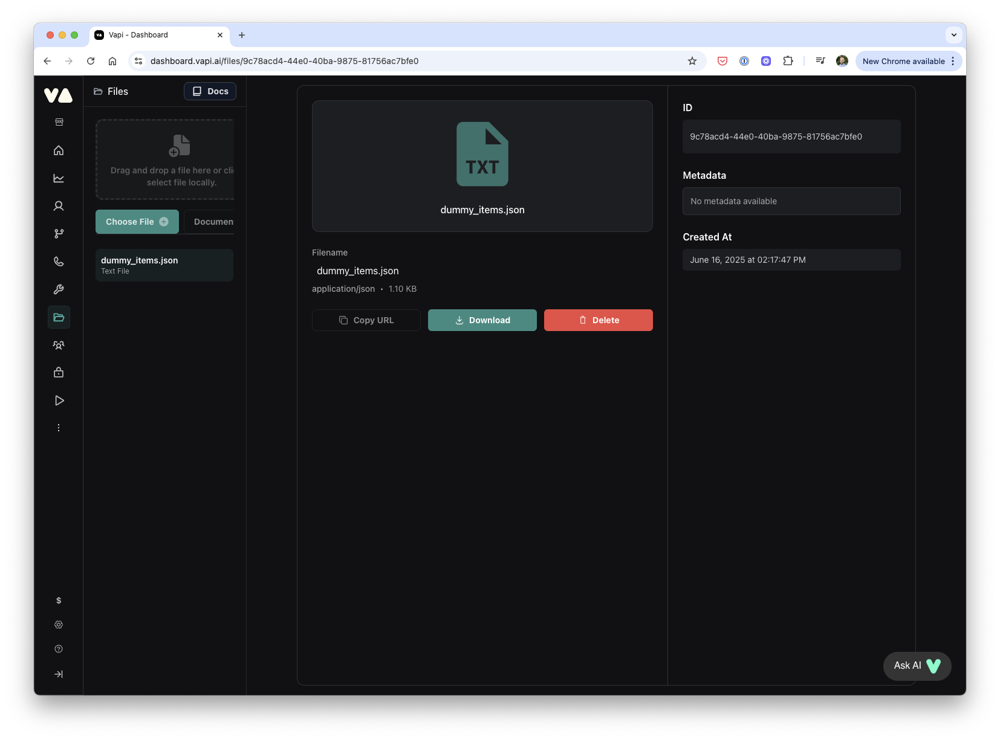

# React Native Amazon Clone with Vapi, Clerk & Sentry

This is a React Native Amazon Clone with Vapi, Clerk & Sentry.

Make sure to also check out the [API Project](https://github.com/Galaxies-dev/amazon-node-api) for this project.

Additional features:

- [Expo Router](https://docs.expo.dev/routing/introduction/) file-based navigation
- [Vapi](https://vapi.ai/) for AI voice agents
- [Sentry](https://dub.sh/sentry-galaxies) for error tracking
- [Clerk Passkeys](https://docs.clerk.com/passkeys/overview?utm_source=simong&utm_medium=youtube&utm_campaign=captions-clone&dub_id=5zB4z5fxgHWQzbgE) for passwordless authentication
- [Zustand](https://github.com/pmndrs/zustand) for state management
- [NativeWind](https://www.nativewind.dev/) for styling
- [TanStack Query](https://tanstack.com/query/latest) for data fetching
- [Reanimated](https://docs.swmansion.com/react-native-reanimated/) for animations
- [React Hook Form](https://react-hook-form.com/) for form handling
- [Zod](https://zod.dev/) for schema validation
- [React Native MMKV](https://github.com/mrousavy/react-native-mmkv) for secure storage
- [Filament](https://github.com/margelo/react-native-filament) for 3D rendering
- [Bottom Sheet](https://gorhom.dev/react-native-bottom-sheet/) for bottom sheets
- [Stripe React Native SDK](https://docs.expo.dev/versions/latest/sdk/stripe/) for payment processing

### 🎥 Follow the video tutorial

Watch and build this Amazon Clone step by step:

TODO: Add video
<p align="center">
  <a href="https://youtu.be/A8gJFybTPr0?si=MbVOcnPJEfRWCOmi" target="_blank">
    <!--  -->
  </a>
</p>

## Setup

### Environment Setup

Make sure you have the [Expo CLI](https://docs.expo.dev/get-started/set-up-your-environment/) installed.

For the best development experience, you should have [Android Studio](https://developer.android.com/studio) and [Xcode](https://developer.apple.com/xcode/) (Mac only) installed. For more information on setting up your development environment, refer to the [Expo documentation](https://docs.expo.dev/workflow/android-studio-emulator/) for Android Studio and the [React Native documentation](https://reactnative.dev/docs/environment-setup?guide=native) for Xcode.

### App Setup

To build the app, follow these steps:

1. Clone the repository
2. Run `npm install`
3. Run `npx expo prebuild`
4. Run `npx expo run:ios` or `npx expo run:android`

### Setup Environment Variables

Create a new file named `.env` in the root of your project and add the following content:

```env
EXPO_PUBLIC_CLERK_PUBLISHABLE_KEY=
EXPO_PUBLIC_API_URL=http://localhost:3000
EXPO_PUBLIC_VAPI_KEY=
EXPO_PUBLIC_STRIPE_PUBLISHABLE_KEY=
EXPO_PUBLIC_VAPI_WORKFLOW_ID=
EXPO_PUBLIC_VAPI_ASSISTANT_ID=
```

Replace the placeholders with your own values.

### Vapi Setup

Create your Vapi account and then add a new Assistant with your preferred settings.


Copy the Assistant ID and add it to the `.env` file.

Create a new Workflow in the Vapi dashboard.


Copy the Workflow ID and add it to the `.env` file.

If you want to give your assistant access to a knowledge base, upload the dummy_items.json from our [API](https://github.com/Galaxies-dev/amazon-node-api) to the knowledge base.



### Sentry Setup

1. Create a new project on [Sentry](https://dub.sh/sentry-galaxies)
2. Use the `npx @sentry/wizard@latest -s -i reactNative` command to setup Sentry for your project


## App Screenshots

<div style="display: flex; flex-direction: 'row';">


</div>

## Demo

<div style="display: flex; flex-direction: 'row';">


</div>

## Sentry Screenshots

<div style="display: flex; flex-direction: 'row';">


</div>

## 🚀 More

**Take a shortcut from web developer to mobile development fluency with guided learning**
Enjoyed this project? Learn to use React Native to build production-ready, native mobile apps for both iOS and Android based on your existing web development skills.

<a href="https://galaxies.dev?utm_source=simongrimm&utm_medium=github&vid=ai-captions-editor"></a>
